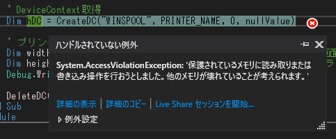
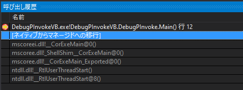
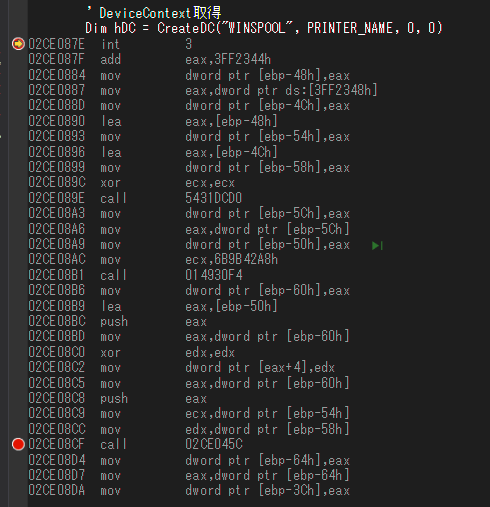
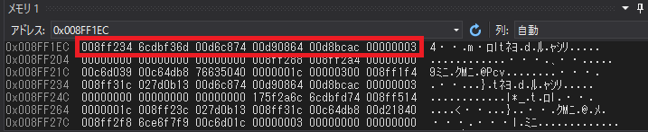
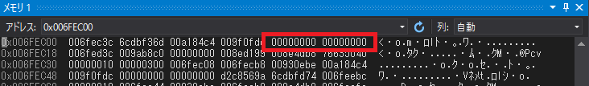

# VB.NETからWindows APIの呼び出し(PInvoke)をステップインして動作確認を行うための手順(AccessViolationException)

## 前書き

* VB6のソースをVB.NETに移行した場合に苦労するのがAPI呼び出しエラーの修正です。困ったときの助けになればと思います。

* Visual Studioのネイティブデバッグ機能を使い、Windows API側に引き渡されている引数の値を**API側から**確認する手順を記載します。

  * .NET側からはポインタや、アドレスの参照先がわからないのでネイティブデバッグします。

* Declareの定義を修正、もしくは引数を修正後、本当に想定した値がセットされているのか確認することができます。

* Visual Studioの初期設定では、ネイティブコードデバッグが有効になっていないため、あちこちの設定を変更します。

* 動作確認用のソースはこちらで公開しています。

https://github.com/murasuke/DebugPInvokeVB


## 環境

* Visual Studio 2019 (Visual Basic)

    VS2015以降であれば、ほぼ同じだと思います。

## サンプルソース

* CreateDCの呼び出しでエラーになります(バグっています。VB6のソースをコンバートしたイメージで書いています。)

  * プリンターの描画領域サイズをGetDeviceCaps()で取得するサンプルコードです。
    
  * DeleteDC()の3番目、4番目はnullを指定します(nullがないので0で代用)。本来はDEVMODE構造体を渡すのですが、nullでも動作上は問題ないです。

```vb
Module DebugPInvoke
    ' API定義
    Declare Function CreateDC Lib "gdi32" Alias "CreateDCA" _
        (ByVal lpDriverName As String, ByVal lpDeviceName As String, 
        ByVal lpOutput As String, ByVal lpInitData As Object) As Integer
    Declare Function GetDeviceCaps Lib "gdi32" Alias "GetDeviceCaps" _
        (ByVal hdc As Integer, ByVal nIndex As Integer) As Integer
    Declare Function DeleteDC Lib "gdi32" Alias "DeleteDC" (ByVal hdc As Integer) As Integer

    Sub Main()
        Const PRINTER_NAME = "Microsoft Print to PDF"

        ' DeviceContext取得
        Dim hDC = CreateDC("WINSPOOL", PRINTER_NAME, 0, 0)

        ' プリンターの描画サイズを取得
        Dim width_pix = GetDeviceCaps(hDC, 8) ' 8:HORZRES, ピクセル単位の画面の幅
        Dim height_pix = GetDeviceCaps(hDC, 10) '10:VERTRES, ピクセル単位の画面の高さ
        Debug.WriteLine(PRINTER_NAME & " : " & width_pix & " × " & height_pix)

        DeleteDC(hDC)
    End Sub
End Module
```

* 例外発生画面

  F5で実行すると例外が発生します。

    

    このエラーメッセージでは、どこに原因があるか見当もつきません。ネイティブコードをデバッグできるように設定して、API側から引数を調べてみます。

## デバッグのための準備

1. ネイティブデバッグの有効化

    `プロジェクトのプロパティー` ⇒ `デバッグ` ⇒ `ネイティブコードデバッグを有効にする`にチェック

    

1. アドレスレベルのデバッグを有効にする

    メニューバーの`ツール` ⇒ `オプション` ⇒ `デバッグ` ⇒ `全般` ⇒ `アドレスレベルのデバッグを有効にする`にチェック

1. マイコードのみを有効にするのチェックを外します（ネイティブコードにステップインできるようにするため）

    メニューバーの`ツール` ⇒ `オプション` ⇒ `デバッグ` ⇒ `全般` ⇒ `マイコードのみを有効にする`のチェックを外す

    

1. シンボルサーバーからpdb読み込み有効化(スタックトレースにネイティブコードの関数名を表示するため)

    メニューバーの`ツール` ⇒ `オプション` ⇒ `デバッグ` ⇒ `シンボル` ⇒ `Microsoftシンボルサーバー`にチェック

    

    ※デバッグ開始時に多少時間がかかるようになります。

これで完了です。

## ネイティブコード側からAPIの引数を確認する

### ここではネイティブコードにステップインするため、デバッグを開始してから設定をを行います。

1. `CreateDC()`行にブレークポイントセット(`F9`)
1. `F5`でデバッグを開始して、ブレークポイント(`CreateDC`)で止まるのを待ちます(シンボル情報をダウンロードするため少し時間がかかる)
1. `呼び出し履歴`を表示

    メニューバーの`デバッグ` ⇒ `ウィンドウ` ⇒ `呼び出し履歴` 

    

    `マイコードのみを有効にする`のチェックを外したため、ネイティブコードの関数名も表示されています。

1. ソースコードを右クリックして`逆アセンブリへ移動`をクリック

    

    __ソースコードが`逆アセンブル`された状態で表示されます__

### F5を押してエラー箇所まで実行する

1. 例外が発生した箇所`gdi32full.dll!_GdiConvertToDevmodeW@4`で止まり、表示される例外ダイアログもネイティブコードの例外エラー(0xC0000005 メモリアクセス違反)に変わります。

    

    

### `CrateDC()`側から引数を確認する (スタックのベースポインタ(EBP)から探します)

1. `呼び出し履歴`から`gdi32.dll!_CreateDCA@16()`を選択します

1. `メモリ`ウィンドウを表示します(スタックとポインタの参照先を表示するため2つ表示します)

    メニューバーの`デバッグ` ⇒ `ウィンドウ` ⇒ `メモリ1` と `メモリ2`をクリック

    ※表示されない場合は`Ctrl + Alt + M, 1` (CtrlとAltとMを同時押しした後、1を押す)

1. メモリウィンドウを右クリックして `4バイトの変数` と `16進数で表示` を選択します

    32bitのプロセスで動いているため、4バイト単位に区切って表示をします。

1. メモリ1のアドレスに`ebp`と入力します。(ベースポインタ⇒スタック上に確保されているデータの格納領域の基点)

    

    `ebp`はCPUのレジスタの名前です。詳細は下記のページなどを参照してくださいい。

    [x86アセンブリ言語での関数コール](https://vanya.jp.net/os/x86call/)

    [スタックフレーム - 関数に渡される引数を知る](https://www.keicode.com/debug/dbg205.php)


* 左上から順に、ひとつ前のフレームのEBP、リターンアドレス(関数の戻り先アドレス)、引数1、引数2、引数3、引数4です。

    |  アドレス  | 説明  |
    | ---- | ---- |
    | 008ff234  | ひとつ前のフレームのEBP |
    | 6cdbf36d  | リターンアドレス |
    | 00d6c874  | 引数1 |
    | 00d90864  | 引数2 |
    | 00d8bcac  | 引数3 |
    | 00000003  | 引数4 |


* 引数１「0x00D6C874」をメモリ2で見ると、確かに `WINSPOOL` が入っていることがわかります

    

    同様に引数2には`Microsoft Print to PDF`が入っています。

    

* 引数3と引数4を見ると、ソース上では`0(null)`を渡したつもりですが、なぜか0ではない値(00d8bcac,00000003)がセットされてます。

```VB
    Dim hDC = CreateDC("WINSPOOL", PRINTER_NAME, 0, 0)
```

* 引数3の値のアドレスを見ると文字列で'0'が入っています。⇒引数の型をStringで宣言しているため、数値の0が文字に変換され、そのポインタがCrateDC()に渡されていることがわかります。

    

* 引数4の`00000003`は何かわかりませんが、少なくとも期待していた`0`ではない値がセットされていることがわかります。


    __VB側で渡した値と異なる原因はDeclareの宣言がまちがっているためです。修正してもう一度試してみます__


## APIの定義を修正して、もう一度引数を確認してみます

* 3番目の引数と、4番目の引数を`IntPtr`に変更します

```vb
Declare Function CreateDC Lib "gdi32" Alias "CreateDCA" _
   (ByVal lpDriverName As String, _
   ByVal lpDeviceName As String, _
   ByVal lpOutput As IntPtr, _
   ByVal lpInitData As IntPtr) As Integer
```

もう一度デバッグで確認すると、3番目の引数と4番目の引数に`0（null）`がセットされていることが確認できました。

  


* 例外で停止しなくなるため`逆アセンブリへ移動`した後、下記call命令の位置にブレークポイントをセットして停止させた後、F11でステップインする必要があります。

  


## 後書き

あまり使わない機能ですので、不正確な部分や、説明が不足している箇所があるかもしれません。
添削や過不足あれば、お気軽にご指摘ください。

